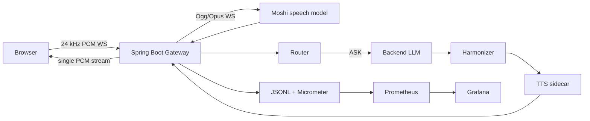

# Two-Tier Voice Assistant Demo

This project is a real-time voice assistant demo with Moshi handling live conversational audio and a backend LLM handling slower reasoning answers.

`PLAN.md` is the canonical implementation plan. Work proceeds phase by phase and stops at each human checkpoint.

## Current Phase

Phase 6 - Hardening + packaging. Automated stub acceptance is complete; full GPU/real-runtime demo recording is the remaining human checkpoint.

## Development Defaults

- Stub mode by default: no GPU, API key, or model-provider network required for CI.
- Gateway: Spring Boot 3.x, Java 21, Maven.
- Real local Moshi target: Apple Silicon MLX q4 with `kyutai/moshiko-mlx-q4`.

## Architecture



Moshi owns the live floor. The backend LLM only answers delegated `ASK` turns,
and the gateway suppresses substantive Moshi answers while the backend job is
in flight.

## Phase 0 Checks

```sh
mvn verify
python3 scripts/validate_router_labels.py docs/eval/router-labels.jsonl
```

## Phase 1 Checks

The gateway exposes `/ws/voice` in stub mode. The Phase 1 integration tests connect to that endpoint, send one 80 ms PCM frame, and assert the echoed audio is byte-equivalent.

```sh
mvn verify
python3 scripts/validate_router_labels.py docs/eval/router-labels.jsonl
```

To try the browser shell:

```sh
java -jar gateway/target/gateway-0.0.1-SNAPSHOT.jar
```

Then open `http://localhost:8080` and use **Connect** followed by **Send Test Frame**.

To talk through real local Moshi from this project, start Moshi first:

```sh
/Users/riteshrajput/.venvs/moshi-mlx/bin/python -m moshi_mlx.local_web \
  -q 4 --host 127.0.0.1 --port 8998 --no-browser
```

Then start the gateway in real Moshi mode:

```sh
MOSHI_MODE=real \
MOSHI_WS_URL=ws://127.0.0.1:8998/api/chat \
STT_MODE=stub \
LLM_MODE=stub \
TTS_MODE=stub \
java -jar gateway/target/gateway-0.0.1-SNAPSHOT.jar
```

Open `http://localhost:8080`, click **Test Speaker** to confirm browser output, then click **Connect** and **Start Mic**. The gateway keeps the browser side as raw 24 kHz PCM and bridges to Moshi's Ogg/Opus protocol internally.

If you see Moshi text in the debug panel but cannot hear audio, check the binary audio lines. `peak` is the raw decoded Moshi PCM level and `out` is the browser output level; values near `0.000` mean Moshi is returning silence for that chunk.

## Phase 2 Checks

Phase 2 adds transcript buffering and router decisions.

```sh
python3 scripts/validate_router_labels.py docs/eval/router-labels.jsonl
python3 scripts/router_eval.py docs/eval/router-labels.jsonl
mvn verify
```

To try the browser router path:

```sh
java -jar gateway/target/gateway-0.0.1-SNAPSHOT.jar
```

Open `http://localhost:8080`, click **Connect**, then click **Send Utterance**.
The debug panel should show `transcript.user` and `router.decision` messages.

The STT sidecar scaffold can be started separately:

```sh
cd stt-service
/opt/homebrew/bin/python3.12 -m venv .venv
. .venv/bin/activate
pip install -r requirements.txt
uvicorn app.main:app --host 0.0.0.0 --port 8081
```

## Phase 3 Checks

Phase 3 adds the ASK job flow: correlation IDs, per-session supersede, stale-drop policy, delayed backend answer, harmonizer, TTS injection, and outbound mixer suppression while injected audio plays. `TTS_MODE=stub` plays a tone; use `TTS_MODE=real` with the TTS sidecar to hear spoken local responses.

```sh
mvn -pl gateway -Dtest=SessionStateMachineTests,Phase3AskFlowIntegrationTests test
mvn -pl gateway verify
python3 scripts/validate_router_labels.py docs/eval/router-labels.jsonl
node --check gateway/src/main/resources/static/app.js
node --check gateway/src/main/resources/static/mic-capture-worklet.js
```

To try the stub ASK path in the browser:

```sh
mvn -pl gateway package
java -jar gateway/target/gateway-0.0.1-SNAPSHOT.jar
```

Open `http://localhost:8080`, click **Test Speaker**, click **Connect**, enter `what is the capital of australia`, then click **Send Utterance**. The debug panel should show `router.decision` with `ASK`, followed by `inject.start`, injected PCM audio, and `inject.end`.

The TTS sidecar contract can be started separately:

```sh
cd tts-service
/opt/homebrew/bin/python3.12 -m venv .venv
. .venv/bin/activate
pip install -r requirements.txt
uvicorn app.main:app --host 0.0.0.0 --port 8082
```

Then start the gateway with `TTS_MODE=real`. On macOS, the sidecar uses the
system `say` voice and returns 24 kHz mono WAV audio to the gateway.

## Phase 4 Checks

Phase 4 adds the ASK-in-flight suppression gate and barge-in cancellation. While
an ASK job is pending, Moshi text beyond `SUPPRESSION_TOKEN_THRESHOLD` causes
Moshi audio to fade to zero over `SUPPRESSION_FADE_MS` and logs
`suppression.faded`. During injected TTS, user speech over `BARGE_IN_MIN_MS`
cancels the injection, logs `barge_in`, and returns the floor.

```sh
mvn -pl gateway -Dtest=Phase4SuppressionBargeInIntegrationTests test
mvn -pl gateway verify
python3 scripts/validate_router_labels.py docs/eval/router-labels.jsonl
python3 scripts/router_eval.py docs/eval/router-labels.jsonl
python3 -m py_compile stt-service/app/main.py tts-service/app/main.py scripts/router_eval.py scripts/validate_router_labels.py stubs/fake-moshi/fake_moshi.py
node --check gateway/src/main/resources/static/app.js
node --check gateway/src/main/resources/static/mic-capture-worklet.js
```

Fake Moshi suppression fixtures:

```sh
python3 stubs/fake-moshi/fake_moshi.py --port 8998 --fixture ack
python3 stubs/fake-moshi/fake_moshi.py --port 8998 --fixture long-answer
```

## Phase 5 Checks

Phase 5 mirrors JSONL events into Micrometer metrics, exposes Prometheus at
`/actuator/prometheus`, adds Prometheus/Grafana provisioning, and adds offline
analysis for latency, suppression rate, router confusion, and flow-break judging.

```sh
mvn -pl gateway verify
python3 metrics/analyze.py metrics/fixtures/events.jsonl --out metrics/out
python3 metrics/judge_flow.py metrics/fixtures/judge-samples.jsonl --out metrics/out --mode stub
python3 scripts/validate_router_labels.py docs/eval/router-labels.jsonl
python3 scripts/router_eval.py docs/eval/router-labels.jsonl
python3 -m py_compile stt-service/app/main.py tts-service/app/main.py scripts/router_eval.py scripts/validate_router_labels.py stubs/fake-moshi/fake_moshi.py metrics/analyze.py metrics/judge_flow.py
node --check gateway/src/main/resources/static/app.js
node --check gateway/src/main/resources/static/mic-capture-worklet.js
```

The fixture analysis writes:

- `metrics/out/latency_chart.png`
- `metrics/out/summary.json`
- `metrics/out/ask_latencies.csv`
- `metrics/out/router_confusion_matrix.csv`
- `metrics/out/judge_summary.json`
- `metrics/out/judge_results.jsonl`

Fixture headline results from Phase 5 validation:

| Metric | Value |
|---|---:|
| ASK latency rows | 3 |
| Perceived latency median | 670 ms |
| Perceived latency p95 | 805 ms |
| True latency median | 9830 ms |
| True latency p95 | 11189 ms |
| Suppression rate | 33.3% |
| Stub judge flow-break rate | 33.3% |

To analyze a real gateway event log after running the patched gateway:

```sh
python3 metrics/analyze.py data/events.jsonl --out metrics/out-real
```

Older event logs from before Phase 5 do not contain `moshi.first_audio`, so
perceived latency can only be computed for sessions recorded after this phase.

To run Prometheus and Grafana:

```sh
mvn -pl gateway package
docker compose up --build gateway prometheus grafana
```

Open `http://localhost:3000` with `admin` / `admin`, then open the
`Voice Two Brains` dashboard. Prometheus is available at `http://localhost:9090`.

## Phase 6 Checks

Phase 6 adds WebSocket bearer-token auth, browser auto-reconnect, real sidecar
startup health retries, transient LLM retry/fallback behavior, pinned container
images, Docker health checks, CI image builds, and concurrent-session isolation
coverage.

```sh
mvn -pl gateway -Dtest=BearerTokenHandshakeIntegrationTests,ConcurrentSessionIsolationIntegrationTests test
mvn -pl gateway verify
python3 scripts/validate_router_labels.py docs/eval/router-labels.jsonl
python3 scripts/router_eval.py docs/eval/router-labels.jsonl
python3 metrics/analyze.py metrics/fixtures/events.jsonl --out metrics/out
python3 metrics/judge_flow.py metrics/fixtures/judge-samples.jsonl --out metrics/out --mode stub
python3 -m py_compile stt-service/app/main.py tts-service/app/main.py scripts/router_eval.py scripts/validate_router_labels.py stubs/fake-moshi/fake_moshi.py metrics/analyze.py metrics/judge_flow.py
node --check gateway/src/main/resources/static/app.js
node --check gateway/src/main/resources/static/mic-capture-worklet.js
docker compose config
docker compose -f docker-compose.yml -f docker-compose.gpu.yml config
```

CPU compose stack:

```sh
docker compose up --build
```

Expected services: gateway `8080`, STT `8081`, TTS `8082`, Prometheus `9090`,
Grafana `3000`.

Real Moshi on this Mac:

```sh
/Users/riteshrajput/.venvs/moshi-mlx/bin/python -m moshi_mlx.local_web \
  -q 4 --host 0.0.0.0 --port 8998 --no-browser

docker compose -f docker-compose.yml -f docker-compose.gpu.yml up --build
```

If `VOICE_WS_TOKEN` is set, `/ws/voice` requires a bearer token. The browser can
pass it with `http://localhost:8080/?token=<token>` or by setting
`localStorage.voiceWsToken`.

## Demo Metrics

The fixture chart is generated at `metrics/out/latency_chart.png` by:

```sh
python3 metrics/analyze.py metrics/fixtures/events.jsonl --out metrics/out
```

Current fixture metrics:

| Metric | Value |
|---|---:|
| ASK latency rows | 3 |
| Perceived latency median | 670 ms |
| Perceived latency p95 | 805 ms |
| True latency median | 9830 ms |
| True latency p95 | 11189 ms |
| Suppression rate | 33.3% |
| Stub judge flow-break rate | 33.3% |

The final human checkpoint should replace or supplement this table with real
runtime numbers from a Phase 6 demo run.

## Hard Problems

- Suppression: Moshi is not prompted to stay silent; the gateway detects long Moshi answer attempts during `ASK_IN_FLIGHT` and fades audio out.
- Floor holding: Moshi can acknowledge quickly while the backend LLM works, preserving perceived latency below one second in the intended demo.
- Stale answers: backend results are dropped or reintroduced based on user-turn distance from dispatch.
- One voice, two brains: Moshi handles live conversation; the backend LLM contributes delayed factual answers through TTS injection.
- Barge-in: user speech during injection cancels TTS and returns the floor.

## Future Scope

- Real ACT execution with confirmation and action templates.
- Real streaming STT beyond the current sidecar boundary.
- RAG or web search behind ASK.
- True Kyutai voice matching or in-model Moshi injection.
- Multi-GPU scaling and persistence.
