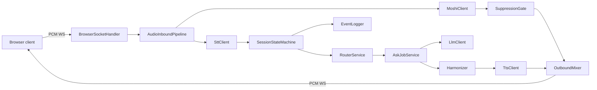
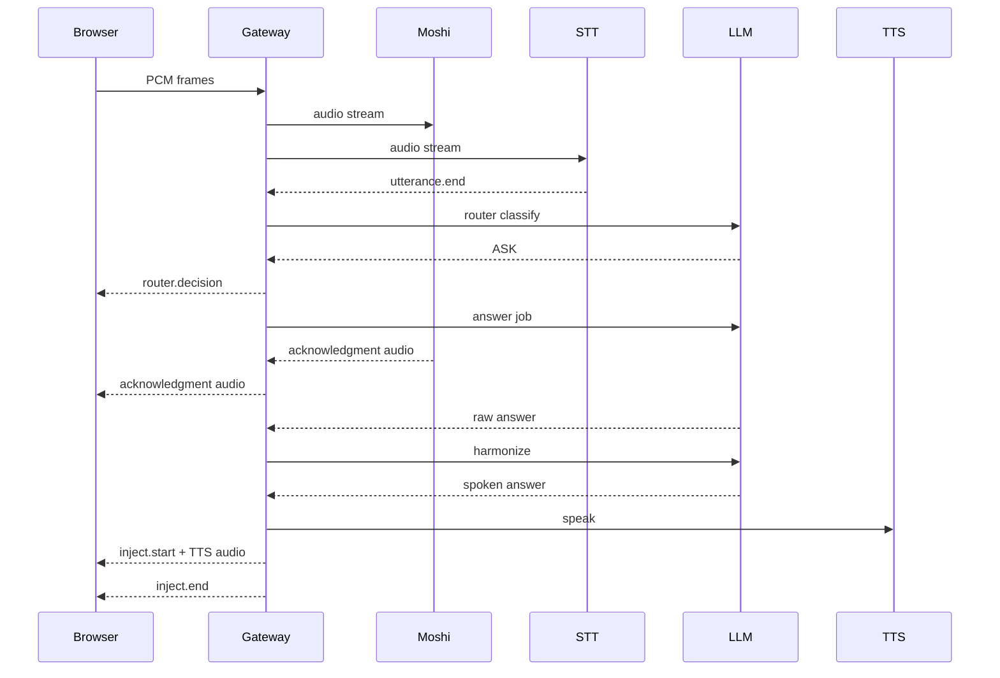
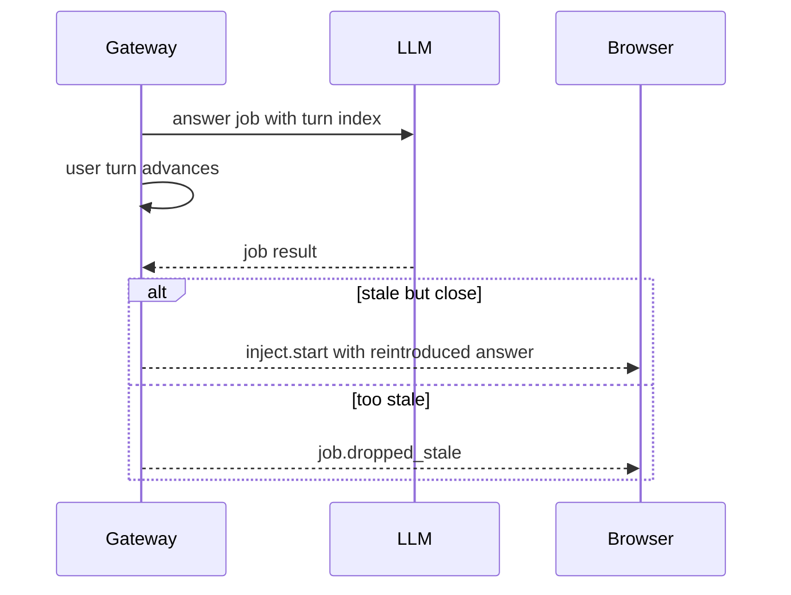
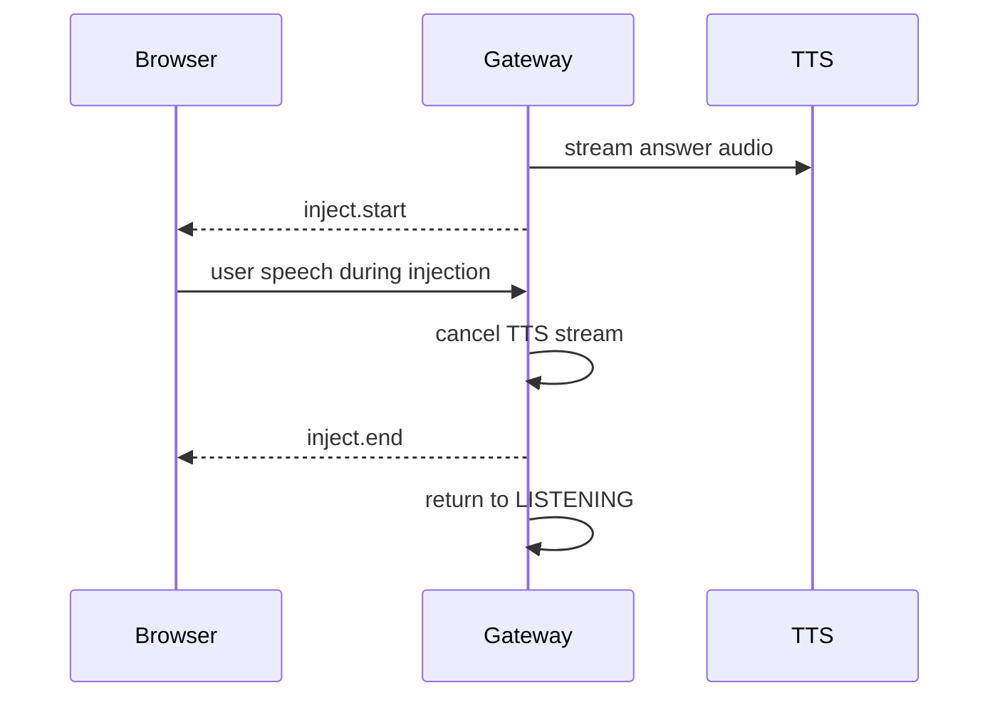

# Architecture

This document records the Phase 0 architecture artifacts. Later phases must keep it current as behavior is implemented.

## Gateway Components

## Happy ASK Sequence

## Stale Answer Sequence

## Barge-In Sequence

